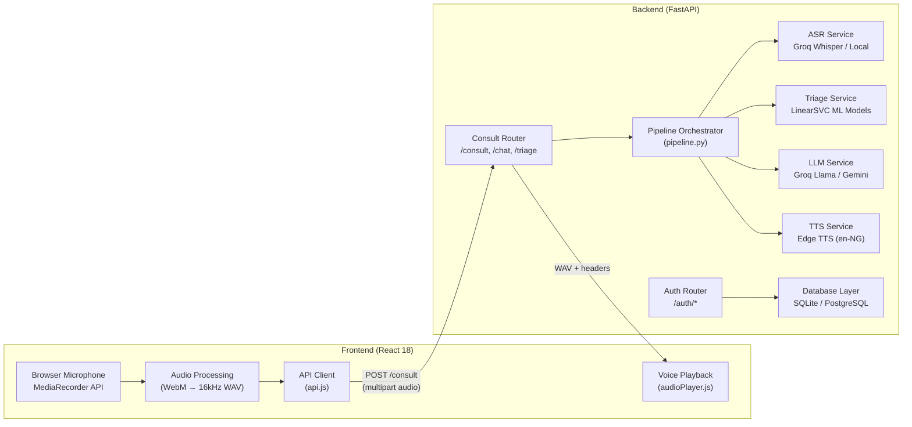
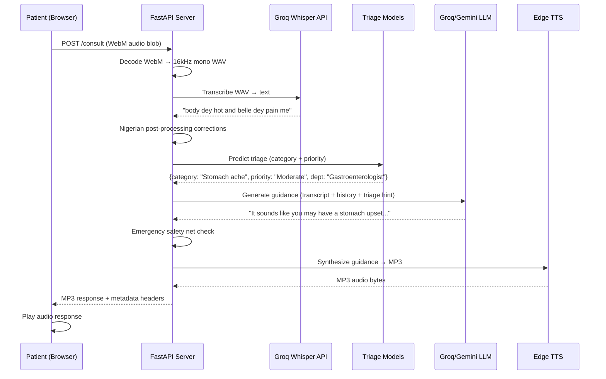
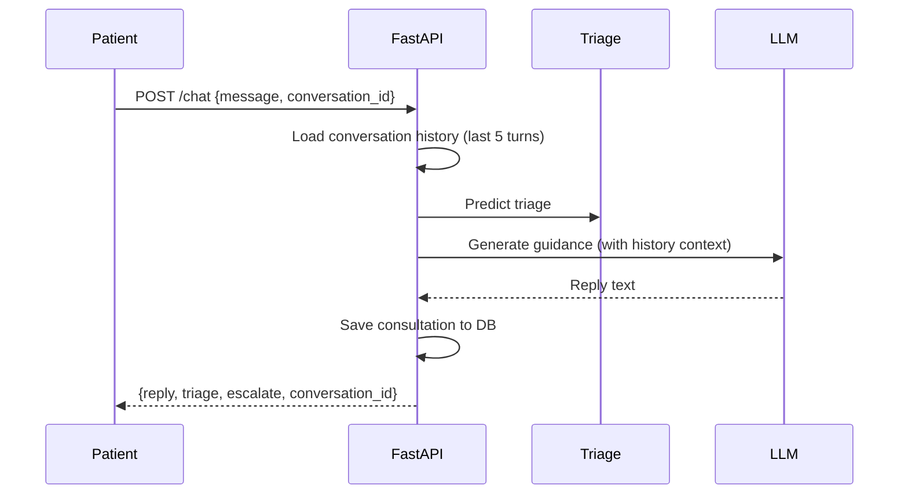
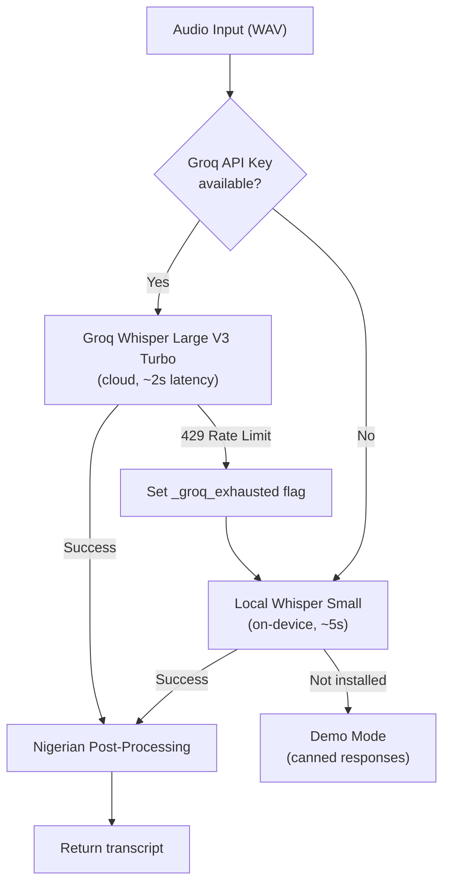
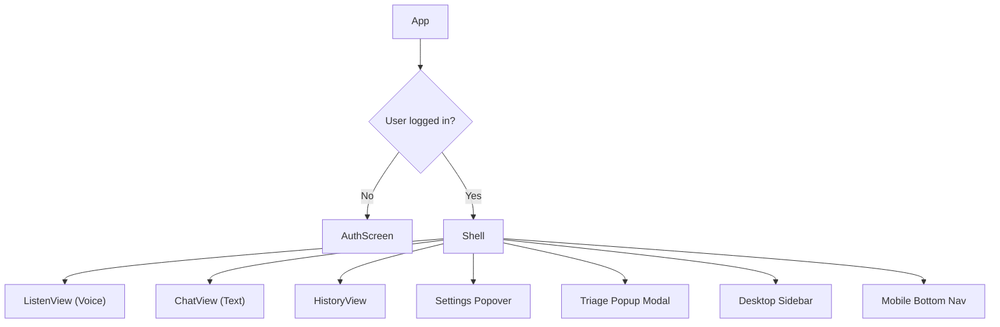
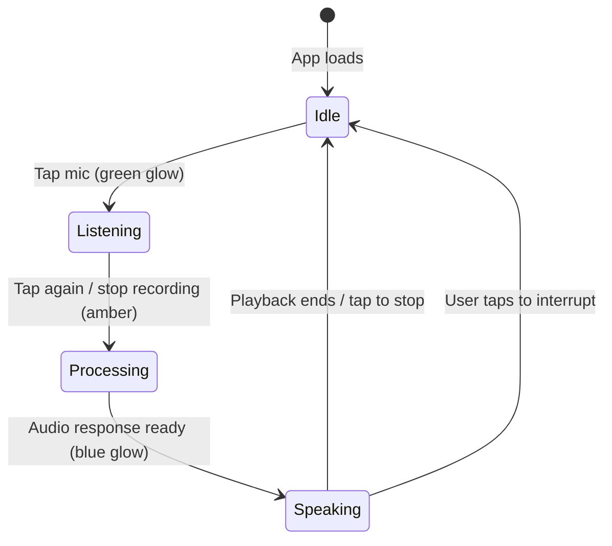
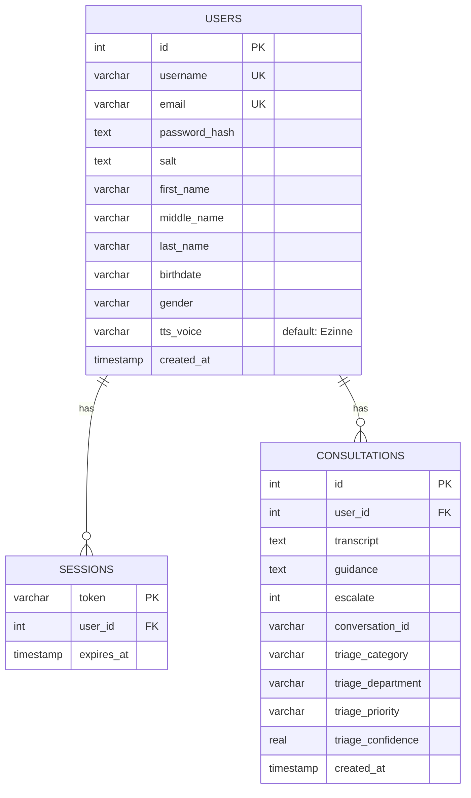
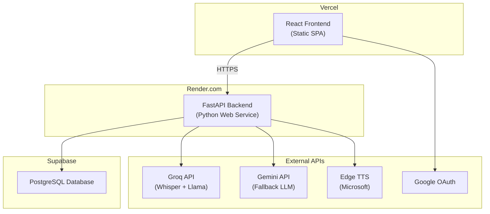

# VoiceMedAI — Complete Technical Documentation

> **For**: FUTA Final Year Project Report  
> **System**: Voice-based Medical AI Assistant for Nigerian Primary Healthcare Centres  
> **Stack**: FastAPI (Python) · React 18 (Vite) · SQLite/PostgreSQL · Scikit-learn · Edge TTS · Groq/Gemini LLM

---

## Table of Contents

1. [Project Overview & Use Case](#1-project-overview--use-case)
2. [System Architecture](#2-system-architecture)
3. [Project Structure](#3-project-structure)
4. [Functional Requirements](#4-functional-requirements)
5. [Non-Functional Requirements](#5-non-functional-requirements)
6. [Implementation Details](#6-implementation-details)
   - 6.1 [Voice Pipeline (ASR → Triage → LLM → TTS)](#61-voice-pipeline)
   - 6.2 [Automatic Speech Recognition (ASR)](#62-automatic-speech-recognition)
   - 6.3 [Nigerian Speech Post-Processing](#63-nigerian-speech-post-processing)
   - 6.4 [Triage Classification (ML)](#64-triage-classification-ml)
   - 6.5 [LLM Reasoning Engine](#65-llm-reasoning-engine)
   - 6.6 [Text-to-Speech (TTS)](#66-text-to-speech)
   - 6.7 [Audio Processing Layer](#67-audio-processing-layer)
7. [Frontend Architecture](#7-frontend-architecture)
8. [Database Design](#8-database-design)
9. [Authentication & Session Management](#9-authentication--session-management)
10. [API Reference](#10-api-reference)
11. [Security & NDPR Compliance](#11-security--ndpr-compliance)
12. [ML Training Methodology](#12-ml-training-methodology)
13. [Deployment Architecture](#13-deployment-architecture)
14. [Data Files & Knowledge Base](#14-data-files--knowledge-base)
15. [Configuration Reference](#15-configuration-reference)

---

## 1. Project Overview & Use Case

### Problem Statement

Primary Healthcare Centres (PHCs) in Southwest Nigeria face a critical shortage of trained medical personnel, particularly in rural Ondo State. Community Health Extension Workers (CHEWs) serve as the primary point of care, often without real-time access to specialist guidance. Patients presenting with symptoms expressed in Nigerian Pidgin English, Yoruba-English code-switching, or Nigerian-accented English cannot effectively use text-based health tools.

### Solution

**VoiceMedAI** is a voice-first AI health assistant designed for low-literacy users in Nigerian PHC settings. The system:

- Accepts spoken patient complaints via browser microphone
- Transcribes Nigerian-accented speech using fine-tuned ASR
- Classifies the complaint into 68 medical categories with urgency triage
- Generates culturally appropriate health guidance via LLM
- Responds with natural Nigerian-accented speech (Text-to-Speech)
- Escalates emergencies with clear urgent-care directives

### Target Users

| User | Role |
|---|---|
| **Patients** | Walk-in PHC visitors who describe symptoms by voice |
| **CHEWs** | Community Health Extension Workers who use the system alongside patient consultations |
| **Administrators** | PHC staff who monitor system health via `/status` endpoint |

### Key Innovation

The system bridges the gap between AI health tools (which assume literate, standard-English users) and the reality of Nigerian primary care (where patients speak Pidgin, use cultural idioms for symptoms, and may be illiterate). The ASR post-processing pipeline, Nigerian medical idiom mapping, and culturally-tuned LLM prompt form the core novelty.

---

## 2. System Architecture

### High-Level Architecture



### Data Flow — Full Voice Consultation



### Text Chat Flow (Alternate Path)



---

## 3. Project Structure

```
my-project/
├── backend/                    # FastAPI application
│   ├── main.py                 # App entry point, CORS, security headers, lifespan
│   ├── config.py               # All configuration from environment/.env
│   ├── models.py               # Legacy models (unused — schemas/ replaces this)
│   ├── database/
│   │   └── db.py               # SQLite/PostgreSQL DDL + CRUD (444 lines)
│   ├── dependencies/
│   │   ├── auth.py             # JWT authentication guards (get_current_user)
│   │   └── ratelimit.py        # Sliding-window IP rate limiter
│   ├── routers/
│   │   ├── admin.py            # /health, /status endpoints
│   │   ├── auth.py             # /auth/* — register, login, Google OAuth, export, delete
│   │   └── consult.py          # /consult, /chat, /transcribe, /reason, /speak, /triage
│   ├── schemas/
│   │   ├── auth.py             # Pydantic models: UserRegister, UserLogin, TokenResponse, etc.
│   │   └── consult.py          # Pydantic models: ChatRequest, TriageResult, etc.
│   └── services/
│       ├── asr.py              # ASR: Groq Whisper cloud + local fallback + Nigerian corrections
│       ├── audio.py            # WebM/WAV decoding, resampling to 16kHz mono
│       ├── auth.py             # PBKDF2 password hashing, JWT creation/verification
│       ├── llm.py              # LLM: Groq (Llama 3.1 8B) + Gemini 2.5 Flash Lite
│       ├── pipeline.py         # End-to-end orchestrator: ASR → Triage → LLM → TTS
│       ├── triage.py           # ML triage: LinearSVC models, medical signal detection
│       └── tts.py              # Text-to-Speech: Edge TTS (en-NG-EzinneNeural / AbeoNeural)
│
├── frontend/                   # React 18 + Vite + Tailwind CSS v4
│   ├── index.html              # SPA entry point
│   ├── vite.config.js          # Vite dev server + API proxy
│   └── src/
│       ├── main.jsx            # React DOM root
│       ├── App.jsx             # Entire UI: Auth, Shell, Listen, Chat, History views (~1180 lines)
│       ├── api.js              # API client with auto JWT injection (270 lines)
│       ├── audioPlayer.js      # Dual-strategy audio playback (HTML Audio + Web Audio API)
│       ├── audioUtils.js       # Browser WebM → 16kHz WAV conversion
│       ├── audioCues.js        # UI state audio feedback tones
│       └── index.css           # Tailwind v4 config + mic glow animations
│
├── data/                       # Knowledge base and data files
│   ├── idioms.json             # 163 Nigerian Pidgin → clinical term mappings
│   ├── phc_knowledge.json      # PHC condition guidance for RAG
│   ├── escalation_keywords.json# Red-flag symptom keywords (critical + urgent)
│   ├── category_to_department.json  # 68 categories → specialist department lookup
│   └── voicemed.db             # SQLite database (local dev)
│
├── models/                     # Trained ML model files
│   ├── triage_models_v2.joblib # v2: LinearSVC category (68-class) + priority (13 MB)
│   └── triage_models_small.joblib  # v1 fallback bundle (81 MB)
│
├── scripts/                    # Training, evaluation, and startup scripts
│   ├── train_triage_v2.py      # Production v2 model training script
│   ├── compare_models2.py      # Algorithm comparison (SVC vs RF vs NB vs LR)
│   ├── gen_augment_dataset.py  # Synthetic data augmentation for triage
│   ├── start_server.bat/.sh    # One-click server startup
│   └── start_frontend.bat      # One-click frontend startup
│
├── requirements.txt            # Python dependencies (23 packages)
├── render.yaml                 # Render.com deployment configuration
└── README.md                   # Project documentation
```

---

## 4. Functional Requirements

| ID | Requirement | Implementation | File(s) |
|---|---|---|---|
| FR-01 | Voice capture via browser microphone | MediaRecorder API with WebM Opus codec | [App.jsx](file:///c:/Users/Mide/CURSORCODES/my-project/frontend/src/App.jsx) `startRec()` |
| FR-02 | ASR for Nigerian-accented English | Groq Whisper Large V3 Turbo (cloud) + local Whisper Small fallback | [asr.py](file:///c:/Users/Mide/CURSORCODES/my-project/backend/services/asr.py) |
| FR-03 | Nigerian Pidgin post-processing | 20+ regex-based correction rules for systematic Whisper mishearings | [asr.py](file:///c:/Users/Mide/CURSORCODES/my-project/backend/services/asr.py#L249-L299) |
| FR-04 | Health guidance from LLM | Groq Llama 3.1 8B (primary) + Gemini 2.5 Flash Lite (fallback) | [llm.py](file:///c:/Users/Mide/CURSORCODES/my-project/backend/services/llm.py) |
| FR-05 | Spoken responses via TTS | Microsoft Edge TTS with Nigerian English voices (en-NG) | [tts.py](file:///c:/Users/Mide/CURSORCODES/my-project/backend/services/tts.py) |
| FR-06 | Text chat alternative | `/chat` endpoint for typed symptom input | [consult.py](file:///c:/Users/Mide/CURSORCODES/my-project/backend/routers/consult.py#L125-L157) |
| FR-07 | Escalation alerts for emergencies | Red-flag regex patterns + Emergency triage override + deterministic safety prefix | [triage.py](file:///c:/Users/Mide/CURSORCODES/my-project/backend/services/triage.py#L137-L148), [pipeline.py](file:///c:/Users/Mide/CURSORCODES/my-project/backend/services/pipeline.py#L83-L100) |
| FR-08 | ML triage classification | LinearSVC over 68 medical categories + 4 priority levels | [triage.py](file:///c:/Users/Mide/CURSORCODES/my-project/backend/services/triage.py#L253-L303) |
| FR-09 | Department routing | Deterministic lookup from predicted category → specialist | [category_to_department.json](file:///c:/Users/Mide/CURSORCODES/my-project/data/category_to_department.json) |
| FR-10 | Consultation history | Multi-turn conversations with session persistence | [db.py](file:///c:/Users/Mide/CURSORCODES/my-project/backend/database/db.py#L400-L455) |
| FR-11 | User authentication | JWT-based auth with Google OAuth, PBKDF2 password hashing | [auth.py](file:///c:/Users/Mide/CURSORCODES/my-project/backend/services/auth.py) |
| FR-12 | NDPR data rights | Export all data (JSON), delete account + all data | [auth.py router](file:///c:/Users/Mide/CURSORCODES/my-project/backend/routers/auth.py#L268-L312) |
| FR-13 | Delete conversations | Individual conversation deletion from history | [auth.py router](file:///c:/Users/Mide/CURSORCODES/my-project/backend/routers/auth.py#L299-L312) |
| FR-14 | Voice selection | Two Nigerian TTS voices: Ezinne (female) and Abeo (male) | [tts.py](file:///c:/Users/Mide/CURSORCODES/my-project/backend/services/tts.py#L47-L63) |
| FR-15 | Dark/light theme | System-preference-aware theme toggle with localStorage persistence | [App.jsx](file:///c:/Users/Mide/CURSORCODES/my-project/frontend/src/App.jsx#L18-L28) |

---

## 5. Non-Functional Requirements

| ID | Requirement | Target | Implementation |
|---|---|---|---|
| NFR-01 | **Response latency** | < 8 seconds for full voice pipeline | Groq Whisper API (~2s) + Groq LLM (~2s) + Edge TTS (~1s) |
| NFR-02 | **Availability** | 99.5% uptime | Render.com managed hosting with auto-restart |
| NFR-03 | **Security** | NDPR-compliant health data handling | CORS lockdown, HSTS, security headers, PII log redaction, PBKDF2 hashing |
| NFR-04 | **Scalability** | Single-instance (PHC use case) | In-memory rate limiting, SQLite for local, PostgreSQL for production |
| NFR-05 | **Accessibility** | Low-literacy users | Voice-first UI, large tap targets (44×44dp+), audio feedback cues |
| NFR-06 | **Cross-platform** | Any modern browser | Responsive design (mobile-first), MediaRecorder API, Web Audio API |
| NFR-07 | **Data privacy** | No health data in logs | All transcript/guidance logging redacted to character counts only |
| NFR-08 | **Graceful degradation** | Works without any single service | LLM fallback chain (Groq → Gemini → static), ASR fallback (Groq → local Whisper → demo) |
| NFR-09 | **Cultural sensitivity** | Nigerian English communication style | LLM system prompt tuned for warm, natural Nigerian English without slang |
| NFR-10 | **Medical safety** | Never replace professional care | Disclaimer in UI, escalation for emergencies, "not a diagnosis" consent |

---

## 6. Implementation Details

### 6.1 Voice Pipeline

The core pipeline is orchestrated by [pipeline.py](file:///c:/Users/Mide/CURSORCODES/my-project/backend/services/pipeline.py). Two entry points:

| Function | Path | Flow |
|---|---|---|
| `run_voice_consult()` | `POST /consult` | Audio → ASR → Triage → LLM → TTS → MP3 response |
| `run_consult_text()` | `POST /chat` | Text → Triage → LLM → JSON response |

**Emergency Safety Net** ([pipeline.py L83-100](file:///c:/Users/Mide/CURSORCODES/my-project/backend/services/pipeline.py#L83-L100)): If triage classifies a complaint as "Emergency" but the LLM's response doesn't contain urgent-care keywords (hospital, emergency, ambulance, etc.), the system deterministically prepends:
> *"Please go to the nearest hospital now, or call for emergency help — this may be serious."*

This ensures the patient always receives an explicit urgent directive, regardless of LLM behaviour.

---

### 6.2 Automatic Speech Recognition

**File**: [asr.py](file:///c:/Users/Mide/CURSORCODES/my-project/backend/services/asr.py) (321 lines)

**Strategy**: Cloud-first with local fallback.



**Nigerian Medical Prompt** ([asr.py L41-49](file:///c:/Users/Mide/CURSORCODES/my-project/backend/services/asr.py#L41-L49)): Whisper's `initial_prompt` parameter is seeded with Nigerian medical vocabulary to prime the decoder:
```
"The patient has fever, malaria, typhoid, hypertension, and diabetes.
She feels pain in her chest, abdomen, waist, and joints..."
```
This significantly improves recognition of Nigerian-accented medical terms.

**Audio Preprocessing**: All browser audio (WebM Opus) is decoded to 16kHz mono PCM WAV using PyAV before being sent to the ASR engine. Peak normalization ensures consistent input levels.

---

### 6.3 Nigerian Speech Post-Processing

**File**: [asr.py L249-299](file:///c:/Users/Mide/CURSORCODES/my-project/backend/services/asr.py#L249-L299)

Whisper systematically mishears Nigerian-accented English. The post-processor applies 20+ regex rules in five categories:

| Category | Example Correction | Regex Pattern |
|---|---|---|
| **Phonetic base words** | "belly" → "belle", "waste" → "waist" | `\bbelly\b` → `belle` |
| **Auxiliary verb "dey"** | "body they hot" → "body dey hot" | `(body\|chest\|...) (?:they\|day\|the)` → `\1 dey` |
| **Medical terms** | "tyford" → "typhoid", "diabetis" → "diabetes" | `\b(?:tyford\|tyfor)\b` → `typhoid` |
| **Aspectual "don"** | "done swell" → "don swell" | `(?:done\|down) (swell\|big\|...)` → `don \1` |
| **Reduplication** | "small small" → "small-small" | `\bsmall\s+small\b` → `small-small` |

These corrections are linguistically motivated by Nigerian English phonological patterns:
- "th" → "d" or "t" (this → dis, three → tree)
- "v" → "b" (very → berry, fever → feber)
- Final consonant dropping (chest → ches)

---

### 6.4 Triage Classification (ML)

**File**: [triage.py](file:///c:/Users/Mide/CURSORCODES/my-project/backend/services/triage.py) (304 lines)

**Architecture (v2)**:

| Model | Algorithm | Classes | Test Accuracy | Training Data |
|---|---|---|---|---|
| **Category** | LinearSVC + TF-IDF | 68 medical categories | 88.1% | HealthCare patient comments dataset |
| **Priority** | LinearSVC + TF-IDF | 4 levels (Emergency/High/Moderate/Low) | 74.4% | Real-world + synthetic triage data |
| **Department** | Deterministic lookup | 30+ specialists | 100% (by definition) | [category_to_department.json](file:///c:/Users/Mide/CURSORCODES/my-project/data/category_to_department.json) |

**Confidence Scoring** ([triage.py L111-134](file:///c:/Users/Mide/CURSORCODES/my-project/backend/services/triage.py#L111-L134)): LinearSVC has no probability output, so confidence is derived from the top-2 decision-score margin:
```
confidence = margin / (1 + margin)
```
Where `margin = score_1st - score_2nd`. This is bucketed into bands:
- **High** (margin ≥ 0.8): Clear, unambiguous prediction
- **Medium** (margin ≥ 0.25): Moderate confidence
- **Low** (margin < 0.25): Uncertain — UI warns "preliminary"

**Medical Signal Gate** ([triage.py L164-243](file:///c:/Users/Mide/CURSORCODES/my-project/backend/services/triage.py#L164-L243)): The classifier always returns *some* class, even for non-medical text. A relevance gate prevents spurious predictions:
- **Strong terms** (symptoms, conditions, medications): One is enough to trigger prediction
- **Weak terms** (body parts alone): Need ≥ 2 to trigger
- Greetings and small talk: Never trigger

**Emergency Override** ([triage.py L137-148](file:///c:/Users/Mide/CURSORCODES/my-project/backend/services/triage.py#L137-L148)): Red-flag regex patterns (convulsions, unconscious, snake bite, suicide, poisoning, etc.) force Emergency classification regardless of ML output — the priority model's Emergency recall (~53%) is too low to trust alone for life-threatening situations.

---

### 6.5 LLM Reasoning Engine

**File**: [llm.py](file:///c:/Users/Mide/CURSORCODES/my-project/backend/services/llm.py) (270 lines)

**Provider Chain**:
1. **Groq** (Llama 3.1 8B Instant) — primary, fastest (~2s)
2. **Gemini** (2.5 Flash Lite) — fallback
3. **Static fallback** — hardcoded safe response if all APIs fail

**System Prompt** ([llm.py L14-79](file:///c:/Users/Mide/CURSORCODES/my-project/backend/services/llm.py#L14-L79)): The 80-line system prompt defines "Priscilla," the AI health assistant. Key design decisions:

| Directive | Rationale |
|---|---|
| **Health-only scope** | Refuses all non-health queries (code, homework, politics) with one warm redirect sentence |
| **Voice-first length** | 2-4 short sentences (~40-60 words) — one spoken breath, not a lecture |
| **Help first, escalate second** | Give practical first-aid steps before recommending hospital |
| **No avoidance of sensitive topics** | Sexual health, mental health, addictions — all answered openly and factually |
| **No Nigerian slang opening** | Avoids "Oga", "Ejor", "Abeg" — sounds unprofessional in a medical context |
| **Patient context injection** | First name (for warmth), age + gender (for age-appropriate dosing, pregnancy relevance) |

**Triage Integration** ([llm.py L110-147](file:///c:/Users/Mide/CURSORCODES/my-project/backend/services/llm.py#L110-L147)): Only Emergency/High triage predictions are injected as background hints to the LLM. Moderate/Low predictions are display-only (shown in UI) and never influence the LLM response — this prevents the triage model from distorting normal guidance.

**Conversation Context**: Up to 5 prior turns are included in the LLM message history for multi-turn coherence.

---

### 6.6 Text-to-Speech

**File**: [tts.py](file:///c:/Users/Mide/CURSORCODES/my-project/backend/services/tts.py) (69 lines)

**Engine**: Microsoft Edge TTS via the `edge-tts` Python package (free, no API key required).

| Voice ID | Edge TTS Voice | Gender | Accent |
|---|---|---|---|
| `Ezinne` | `en-NG-EzinneNeural` | Female | Nigerian English |
| `Abeo` | `en-NG-AbeoNeural` | Male | Nigerian English |

**Output**: Raw MP3 bytes, streamed directly to the browser. The user selects their preferred voice in Settings.

**Async Execution**: Edge TTS is async, but FastAPI endpoints are synchronous. A helper function ([tts.py L11-34](file:///c:/Users/Mide/CURSORCODES/my-project/backend/services/tts.py#L11-L34)) runs the async coroutine in a dedicated thread with its own event loop to avoid blocking.

---

### 6.7 Audio Processing Layer

**File**: [audio.py](file:///c:/Users/Mide/CURSORCODES/my-project/backend/services/audio.py) (124 lines)

Browsers record audio as WebM (Opus codec), but Whisper requires 16kHz mono WAV. The processing chain:

1. **Format detection**: RIFF header → WAV path; otherwise → PyAV decode path
2. **WebM decoding**: PyAV (`av` package) decodes the Opus stream to raw PCM
3. **Channel mixing**: Multi-channel → mono (average)
4. **Resampling**: Linear interpolation to 16kHz (from typically 48kHz browser capture)
5. **WAV encoding**: Standard PCM WAV header + 16-bit signed integer samples

---

## 7. Frontend Architecture

**File**: [App.jsx](file:///c:/Users/Mide/CURSORCODES/my-project/frontend/src/App.jsx) (~1180 lines, single-file React app)

### Component Hierarchy



### Views

| View | Description | Key Feature |
|---|---|---|
| **ListenView** | Central mic button with glow animations | 4-state FSM: Idle → Listening → Processing → Speaking |
| **ChatView** | Chat bubbles (patient right, Priscilla left) | Inline triage badges, read-aloud button per message |
| **HistoryView** | Grouped by date (Today/Yesterday/Earlier/Older) | Resume, delete, priority pills per conversation |

### State Machine (Microphone)



### Audio Feedback Cues

| State Transition | Tone | Frequency |
|---|---|---|
| App ready | A4 | 440 Hz, 120ms |
| Start listening | C5 | 523 Hz, 100ms |
| Processing | E4 | 330 Hz, 150ms |
| Speaking | G4 | 392 Hz, 120ms |
| Error | A3 | 220 Hz, 250ms |

### Responsive Design

- **Mobile**: Bottom navigation (Listen/Chat/History tabs), full-width views
- **Desktop**: Sidebar with conversation list + main content area, view switcher in top bar
- **Theme**: Dark/light with system preference detection, persisted in localStorage

---

## 8. Database Design

**File**: [db.py](file:///c:/Users/Mide/CURSORCODES/my-project/backend/database/db.py) (455 lines)

**Dual-backend**: SQLite for local development, PostgreSQL (Supabase) for production. The `DATABASE_URL` environment variable switches between them automatically.

### Entity-Relationship Diagram



### Key Design Decisions

| Decision | Rationale |
|---|---|
| `ON DELETE CASCADE` on foreign keys | NDPR right to erasure — deleting a user automatically removes all sessions and consultations |
| `conversation_id` groups turns | Multi-turn consultations are tracked by a client-generated UUID |
| Triage stored per turn, not per session | Each message gets its own prediction; session-level triage is computed via SQL aggregation |
| Explicit deletes before user delete | Legacy SQLite databases may not have FK cascade; explicit deletes are harmless no-ops on PostgreSQL |

---

## 9. Authentication & Session Management

### Password Security

**File**: [services/auth.py](file:///c:/Users/Mide/CURSORCODES/my-project/backend/services/auth.py)

| Parameter | Value |
|---|---|
| Algorithm | PBKDF2-HMAC-SHA256 |
| Iterations | 260,000 |
| Salt | 256-bit random (`secrets.token_hex(32)`) |
| Comparison | Constant-time (`secrets.compare_digest`) |

### JWT Token Structure

```json
{
  "sub": "42",          // user ID
  "username": "chioma",
  "iat": 1720000000,    // issued at
  "exp": 1720086400,    // expires (24h default)
  "jti": "a1b2c3..."   // unique token ID for session allowlist
}
```

### Session Allowlist

Unlike pure stateless JWT, VoiceMedAI uses a **hybrid approach**:
1. JWT is verified for signature + expiry (stateless check)
2. The `jti` claim is checked against the `sessions` table (stateful check)
3. Logout deletes the `jti` from sessions → immediate invalidation

This enables instant logout without waiting for JWT expiry.

### Google OAuth Flow

1. Frontend loads Google Identity Services SDK
2. User clicks "Continue with Google" → receives a Google ID token
3. Frontend sends the credential to `POST /auth/google`
4. Backend verifies the token via `oauth2.googleapis.com/tokeninfo`
5. Checks `aud` matches our `GOOGLE_CLIENT_ID` and email is verified
6. Auto-creates account on first login, issues our JWT

### Rate Limiting

| Endpoint | Limit | Window |
|---|---|---|
| `POST /auth/login` | 8 requests | 60 seconds |
| `POST /auth/register` | 5 requests | 60 seconds |

Sliding-window counter per client IP (from `X-Forwarded-For`). Returns HTTP 429 with `Retry-After` header.

---

## 10. API Reference

### Authentication Endpoints

| Method | Path | Auth | Description |
|---|---|---|---|
| `POST` | `/auth/register` | — | Create account (rate-limited) |
| `POST` | `/auth/login` | — | Login with username/email + password (rate-limited) |
| `POST` | `/auth/google` | — | Login/register with Google ID token |
| `POST` | `/auth/logout-token` | — | Invalidate a specific session token |
| `GET` | `/auth/me` | Bearer | Get current user profile + consultation history |
| `DELETE` | `/auth/me` | Bearer | Permanently delete account + all data (NDPR) |
| `GET` | `/auth/export` | Bearer | Download all personal data as JSON (NDPR) |
| `POST` | `/auth/voice` | Bearer | Update preferred TTS voice |
| `GET` | `/auth/conversations/{id}` | Bearer | Get all turns for a conversation |
| `DELETE` | `/auth/conversations/{id}` | Bearer | Delete a conversation and all its turns |

### Consultation Endpoints

| Method | Path | Auth | Description |
|---|---|---|---|
| `POST` | `/consult` | Optional | Full voice pipeline: audio → transcript → guidance → TTS |
| `POST` | `/chat` | Optional | Text consultation: message → guidance (no audio) |
| `POST` | `/transcribe` | — | Audio → transcript only |
| `POST` | `/reason` | Optional | Text → guidance only |
| `POST` | `/speak` | Optional | Text → TTS audio |
| `POST` | `/triage` | Optional | Force a triage prediction |

### Admin Endpoints

| Method | Path | Description |
|---|---|---|
| `GET` | `/health` | Liveness check + component status |
| `GET` | `/status` | Full diagnostic (ASR, LLM, TTS, Triage readiness) |

### Custom Response Headers (`/consult`)

| Header | Content |
|---|---|
| `X-VoiceMed-Transcript` | URL-encoded patient transcript (first 200 chars) |
| `X-VoiceMed-Guidance` | URL-encoded AI guidance text |
| `X-VoiceMed-Escalate` | `"true"` or `"false"` |
| `X-VoiceMed-ConversationId` | UUID for multi-turn tracking |
| `X-VoiceMed-Triage` | URL-encoded JSON triage result |

---

## 11. Security & NDPR Compliance

### Security Headers

Every response includes:

| Header | Value | Purpose |
|---|---|---|
| `X-Content-Type-Options` | `nosniff` | Prevent MIME-type sniffing |
| `X-Frame-Options` | `DENY` | Prevent clickjacking |
| `Referrer-Policy` | `no-referrer` | No referrer leakage |
| `Permissions-Policy` | `camera=(), geolocation=()` | Restrict browser APIs |
| `Strict-Transport-Security` | `max-age=63072000; includeSubDomains` | Force HTTPS (production only) |

### CORS Configuration

```python
ALLOWED_ORIGINS = os.getenv("FRONTEND_ORIGINS", "http://localhost:5173").split(",")
# Production: FRONTEND_ORIGINS=https://medvoice.vercel.app
```

No wildcard origins. Only specified origins can make credentialed requests.

### PII Log Redaction

All server log statements that previously contained health data (transcripts, guidance text) have been redacted to log only **operational metadata** (character counts, boolean flags). This prevents Render's log retention from holding uncontrolled copies of patient health information.

### NDPR Compliance Summary

| NDPR Article | Requirement | Status | Implementation |
|---|---|---|---|
| Art. 2.2 | Lawful basis / consent | ✅ | Required consent checkbox at registration |
| Art. 2.3 | Purpose limitation | ✅ | System scoped to health guidance only |
| Art. 2.3 | Data minimisation | ✅ | Only transcript + guidance stored per consultation |
| Art. 3.1(7) | Right of access | ✅ | `GET /auth/export` + "Download my data" button |
| Art. 3.1(8) | Right to erasure | ✅ | `DELETE /auth/me` + "Delete account" with double confirmation |
| Art. 3.1(7) | Data portability | ✅ | JSON export of all personal data |
| Art. 2.7 | Security of processing | ✅ | PBKDF2 hashing, JWT auth, CORS lockdown, HSTS, rate limiting |

### Medical Disclaimer

Displayed persistently in the Listen view footer:
> *"Priscilla offers general first-aid guidance, not a medical diagnosis. For emergencies, go to the nearest health facility immediately."*

---

## 12. ML Training Methodology

### Training Script

**File**: [train_triage_v2.py](file:///c:/Users/Mide/CURSORCODES/my-project/scripts/train_triage_v2.py)

### Category Model (68-class)

| Parameter | Value |
|---|---|
| **Algorithm** | LinearSVC (sklearn) |
| **Features** | TF-IDF (unigrams + bigrams, `min_df=2`, `sublinear_tf=True`) |
| **Regularization** | C = 0.5 |
| **Class weighting** | Balanced (handles class imbalance) |
| **Training data** | HealthCare patient comments dataset (Excel) |
| **Test accuracy** | 88.1% |

### Priority Model (4-class)

| Parameter | Value |
|---|---|
| **Algorithm** | LinearSVC (sklearn) |
| **Features** | TF-IDF (unigrams + bigrams, `min_df=3`, `sublinear_tf=True`) |
| **Regularization** | C = 0.5 |
| **Class weighting** | Balanced |
| **Training data** | Real-world + synthetic + everyday complaint CSVs |
| **Test accuracy** | 74.4% |

### Algorithm Selection

Evaluated via [compare_models2.py](file:///c:/Users/Mide/CURSORCODES/my-project/scripts/compare_models2.py):

| Algorithm | Category Acc | Priority Acc | Selected? |
|---|---|---|---|
| **LinearSVC** | **88.1%** | **74.4%** | ✅ Best overall |
| Logistic Regression | ~86% | ~72% | ❌ |
| Random Forest | ~82% | ~70% | ❌ |
| Naive Bayes | ~79% | ~68% | ❌ |

### Data Augmentation

**File**: [gen_augment_dataset.py](file:///c:/Users/Mide/CURSORCODES/my-project/scripts/gen_augment_dataset.py) (20K lines)

Synthetic data generation for triage training, including Nigerian Pidgin variants of medical complaints.

---

## 13. Deployment Architecture

### Production Stack



### Render Configuration

**File**: [render.yaml](file:///c:/Users/Mide/CURSORCODES/my-project/render.yaml)

```yaml
services:
  - type: web
    name: voicemed-backend
    env: python
    buildCommand: pip install -r requirements.txt
    startCommand: uvicorn backend.main:app --host 0.0.0.0 --port $PORT
```

### Environment Variables (Production)

| Variable | Purpose | Source |
|---|---|---|
| `DATABASE_URL` | PostgreSQL connection string | Supabase |
| `GROQ_API_KEY` | Whisper ASR + Llama LLM | Groq Console |
| `GEMINI_API_KEY` | Fallback LLM | Google AI Studio |
| `JWT_SECRET` | JWT signing key | Auto-generated by Render |
| `GOOGLE_CLIENT_ID` | Google OAuth | Google Cloud Console |
| `FRONTEND_ORIGINS` | CORS allowlist | Set to Vercel deploy URL |

---

## 14. Data Files & Knowledge Base

### Nigerian Pidgin Idiom Mapping

**File**: [idioms.json](file:///c:/Users/Mide/CURSORCODES/my-project/data/idioms.json) (163 entries)

Maps Nigerian Pidgin health expressions to clinical terminology:

| Pidgin Expression | Clinical Term |
|---|---|
| "belle dey pain me" | abdominal pain |
| "chest dey pepper" | chest pain |
| "body dey hot" | fever |
| "pikin no dey suck breast" | poor infant breastfeeding |
| "stool dey rush me" | diarrhoea |
| "i dey purge" | diarrhoea/vomiting |
| "waist dey pain" | lower back pain |
| "eye dey pain me" | eye pain |

### Escalation Keywords

**File**: [escalation_keywords.json](file:///c:/Users/Mide/CURSORCODES/my-project/data/escalation_keywords.json)

Two tiers:
- **Critical** (18 terms): chest pain, convulsion, seizure, unconscious, severe bleeding, stroke, paralysis, suicide, self harm
- **Urgent** (10 terms): high fever, persistent vomiting, blood in stool, severe headache, stiff neck, jaundice

### Category-to-Department Mapping

**File**: [category_to_department.json](file:///c:/Users/Mide/CURSORCODES/my-project/data/category_to_department.json) (68 entries)

Maps each predicted complaint category to the appropriate specialist:

| Category | Department |
|---|---|
| Stomach ache | Gastroenterologist |
| Heart hurts | Cardiologist |
| Emotional pain | Psychiatrist |
| pregnancy issues | Gynecologist |
| Seizures | Neurosurgeon |
| Eye Infection | Ophthalmologist |

---

## 15. Configuration Reference

**File**: [config.py](file:///c:/Users/Mide/CURSORCODES/my-project/backend/config.py) (72 lines)

| Variable | Default | Description |
|---|---|---|
| `JWT_SECRET` | **(required)** | JWT signing key — app refuses to start without it |
| `SESSION_TTL_HOURS` | `24` | JWT token lifetime |
| `VOICEMED_ASR_MODE` | `auto` | `auto` / `whisper` / `demo` |
| `WHISPER_MODEL_SIZE` | `small` | Local Whisper model size (tiny/base/small/medium/large) |
| `LLM_MAX_TOKENS` | `400` | Max tokens for LLM response |
| `LLM_TEMPERATURE` | `0.3` | LLM creativity/determinism balance |
| `FRONTEND_ORIGINS` | `localhost:5173` | CORS allowed origins (comma-separated) |
| `DATABASE_URL` | *unset* | PostgreSQL DSN (when set, switches from SQLite) |
| `AUDIO_CACHE_DIR` | `backend/cache/audio` | TTS audio cache directory |
| `VOICEMED_DB_PATH` | `data/voicemed.db` | SQLite database file path |

---

> [!NOTE]
> This document covers the complete VoiceMedAI system as of July 2026. For the security-specific NDPR brief with file-level diff references, see the companion [ndpr_security_brief.md](file:///C:/Users/Mide/.gemini/antigravity-ide/brain/9c505601-4c61-4592-b1dc-6426a0ffda01/ndpr_security_brief.md) artifact.
